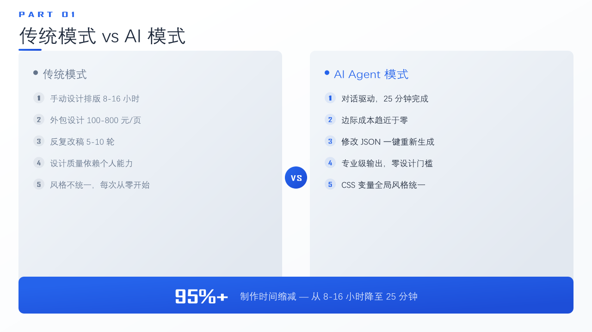
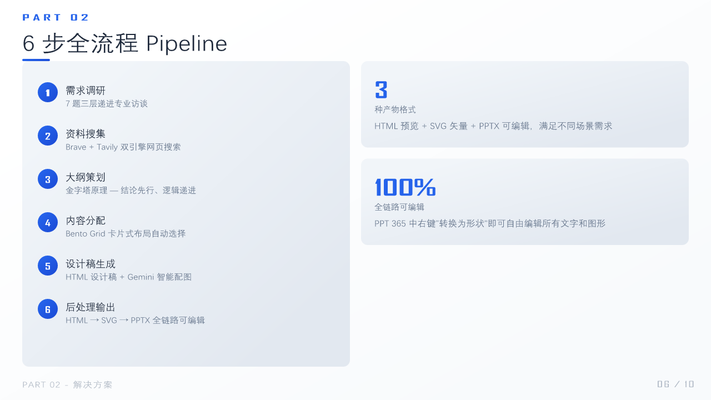
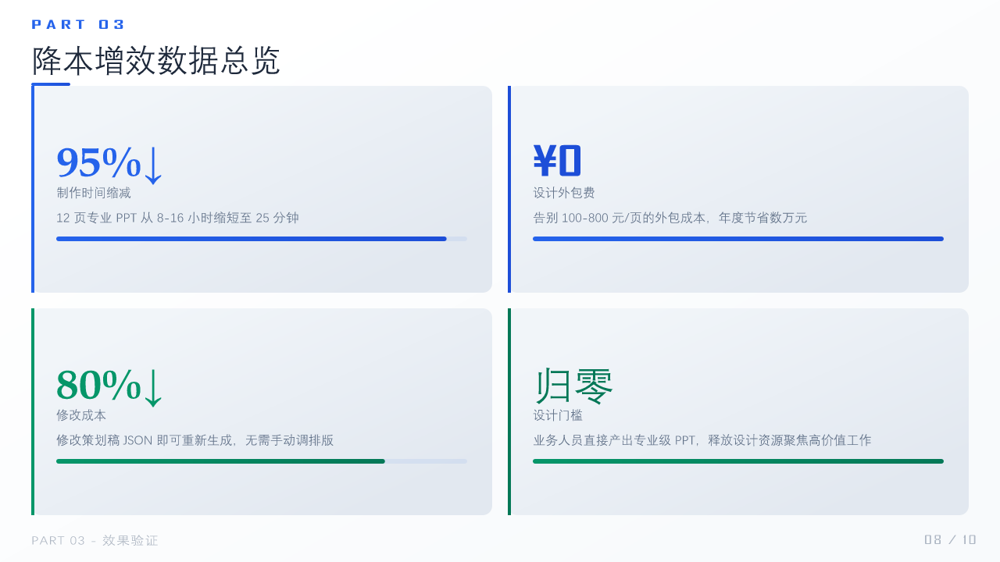
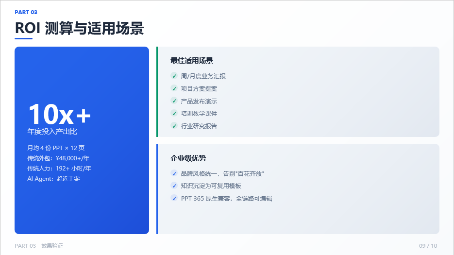
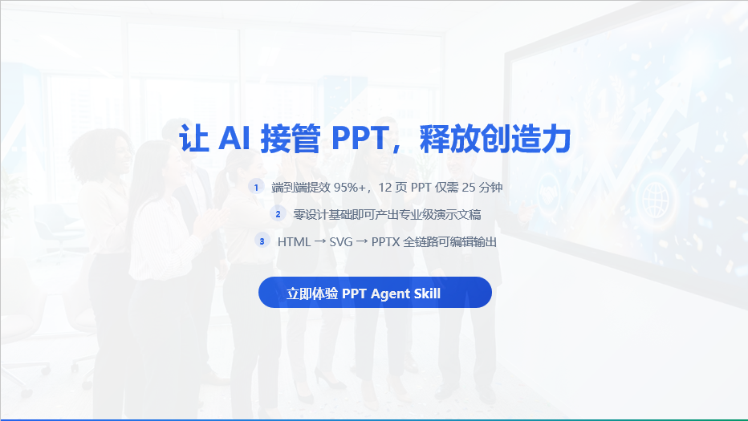

# PPT Agent Skill

**[中文文档](README.md)**

> Simulate a top-tier PPT design company's workflow — from a single sentence to professional-grade presentations.

## Showcase

> Example output: "PPT Agent Skill Cost Reduction" (Blue White business style, 10 pages, ~25 min end-to-end):

| Cover | Traditional vs AI |
|:---:|:---:|
|  |  |

| 6-Step Pipeline | Efficiency Data |
|:---:|:---:|
|  |  |

| ROI Analysis | End Page |
|:---:|:---:|
|  |  |

## Workflow

```
One sentence → Interview → Research → Outline → Planning → Style + Images + HTML → Post-processing (SVG + PPTX)
```

| Step | Description | Tool |
|------|-------------|------|
| Step 1 | Requirements interview (7 questions, 3 layers) | Agent dialog |
| Step 2 | Web research | `web_search.py` (Brave + Tavily dual engine) |
| Step 3 | Outline (Pyramid Principle) | Prompt #2 |
| Step 4 | Content allocation + planning draft | Prompt #3 + Bento Grid layout selection |
| Step 5 | Style + images + HTML design | `generate_image.py` (Gemini) + Prompt #4 |
| Step 6 | Post-processing | `html2svg.py` → `svg2pptx.py` |

## Key Features

| Feature | Description |
|---------|-------------|
| **6-Step Pipeline** | End-to-end automation simulating professional PPT design workflow |
| **Smart Search** | Brave + Tavily dual engine, zero-dependency Python script, auto-fallback |
| **AI Illustrations** | Gemini native image generation, 16:9 widescreen, smart scoping (cover/section/end pages) |
| **8 Preset Styles** | Dark Tech / Xiaomi Orange / Blue White / Royal Red / Fresh Green / Luxury Purple / Minimal Gray / Vibrant Rainbow |
| **7 Bento Grid Layouts** | Flexible card-based layouts, content-driven layout selection |
| **Typography System** | 7-level font scale + CJK typesetting + 60-30-10 color rule |
| **8 Data Visualizations** | Progress bars / ring charts / sparklines / comparison bars / waffle charts / KPI cards (pure CSS/SVG) |
| **Pipeline Compatibility** | `pipeline-compat.md` documents all CSS → SVG → PPTX conversion pitfalls and correct patterns |
| **Fully Editable PPTX** | HTML → SVG → PPTX, right-click "Convert to Shape" in PPT 365 |
| **Cross-platform Portable** | All external capabilities (search/image/conversion) are standalone Python scripts + `.env` config, not tied to any Agent framework |

## Requirements

**Required:**
- **Python** >= 3.8
- **Node.js** >= 18 (Puppeteer + dom-to-svg)

**Install:**
```bash
pip install python-pptx lxml Pillow
```

> **Important**: Puppeteer downloads Chromium (~170MB) on first install, and dom-to-svg
> requires compilation. Pre-install before use to avoid long waits during Step 6:
> ```bash
> cd ppt-output && npm init -y && npm install puppeteer dom-to-svg
> ```
> `html2svg.py` will auto-install missing deps on first run, but the delay may cause timeouts.

**Optional (configure `.env`):**
```bash
cp .env.example .env
# Edit .env with your API keys:
# BRAVE_API_KEY=xxx       — Web search (Brave Search, free 2000 queries/month)
# TAVILY_API_KEY=xxx      — Web search + content extraction (Tavily)
# IMAGE_API_KEY=xxx       — AI illustrations (Gemini image generation)
# IMAGE_API_BASE=xxx      — Image API endpoint
# IMAGE_MODEL=xxx         — Image model name
```

## Directory Structure

```
ppt-agent-skill/
  SKILL.md                        # Agent workflow instructions (entry point)
  .env.example                    # Environment variable template
  references/
    prompts.md                    # 5 Prompt templates
    style-system.md               # 8 preset styles + CSS variables
    bento-grid.md                 # 7 layout specs + 6 card types
    pipeline-compat.md            # HTML→SVG→PPTX pipeline compatibility rules
    method.md                     # Core methodology
  scripts/
    web_search.py                 # Web search (Brave + Tavily dual engine)
    generate_image.py             # AI illustrations (Gemini native image gen)
    html_packager.py              # Merge multi-page HTML into paginated preview
    html2svg.py                   # HTML → SVG (dom-to-svg, editable text)
    svg2pptx.py                   # SVG → PPTX (OOXML native shapes)
  doc/
    showcase/                     # README showcase images
```

## Output

| File | Description |
|------|-------------|
| `ppt-output/presentation.pptx` | PPTX file (right-click "Convert to Shape" in PPT 365) |
| `ppt-output/svg/*.svg` | Per-page vector SVG |
| `ppt-output/slides/*.html` | Per-page HTML source |
| `ppt-output/images/*.png` | AI-generated illustrations |
| `ppt-output/style.json` | Style configuration |
| `ppt-output/outline.json` | Outline structure |
| `ppt-output/planning.json` | Planning draft (detailed card data) |

## Usage

Describe your needs in conversation to trigger the full 6-step workflow:

```
You: "Make a PPT about X"
  → Step 1: Agent interviews for requirements
  → Step 2: web_search.py researches the topic
  → Step 3-4: Generates outline → planning draft
  → Step 5: Style selection + generate_image.py + per-page HTML design
  → Step 6: html2svg.py + svg2pptx.py → PPTX output
```

**Trigger Examples:**

| Scenario | What to Say |
|----------|-------------|
| Topic only | "Make a PPT about X" / "Create a presentation on Y" |
| With material | "Turn this document into slides" / "Make a PPT from this report" |
| With specs | "15-page dark tech style AI safety presentation" |
| Implicit | "I need to present to my boss about Y" / "Make training materials" |

## License

[MIT](LICENSE)
